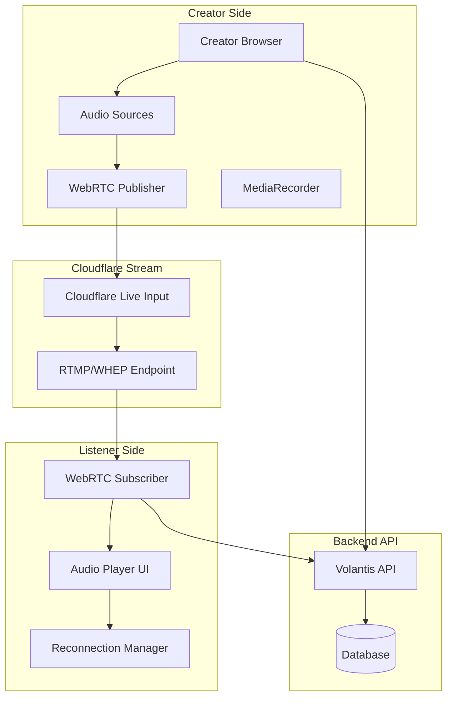

# Audio Streaming Feature Implementation Plan

## Overview

This document outlines the implementation plan for building a scalable, reliable audio-only streaming feature with WebRTC, designed for poor network connectivity with reconnection logic, random thumbnails, and a Windows-app-like creator interface.

---

## System Architecture



---

## Core Components

### 1. TypeScript Types (`src/types/livestream.ts`)

```typescript
// Based on OpenAPI VolLivestreamOut schema
export interface VolLivestreamOut {
  id: number;
  company_id: number;
  title: string;
  slug: string;
  description?: string;
  stream_type: StreamType;
  is_active: boolean;
  start_time: string;
  end_time?: string;
  cf_live_input_uid?: string;
  cf_rtmps_url?: string;
  cf_stream_key?: string;
  cf_webrtc_publish_url?: string;
  cf_webrtc_playback_url?: string;
  recording_url?: string;
  viewer_count: number;
  peak_viewers: number;
  created_by_username: string;
  created_at: string;
}

export interface VolLivestreamPlaybackOut {
  slug: string;
  title: string;
  status: 'live' | 'offline' | 'recording';
  video_uid?: string;
  hls_url?: string;
  dash_url?: string;
  preview_url?: string;
  thumbnail_url?: string;
  webrtc_playback_url?: string;
  ready_to_stream?: boolean;
  created?: string;
}

export type StreamType = 'audio' | 'video';

export interface StartAudioStreamRequest {
  title: string;
  description?: string;
}

export interface StartVideoStreamRequest {
  title: string;
  description?: string;
}
```

### 2. Livestream API Service (`src/lib/api/livestream.ts`)

Functions to implement:
- `startAudioStream(data)` → POST `/livestreams/start/audio`
- `startVideoStream(data)` → POST `/livestreams/start/video`
- `getPlaybackInfo(slug)` → GET `/livestreams/{slug}/playback`
- `stopStream(slug)` → POST `/livestreams/{slug}/stop`
- `getCompanyLivestreams(limit, offset)` → GET `/livestreams`
- `getLivestream(slug)` → GET `/livestreams/{slug}`
- `uploadRecording(slug, blob)` → POST `/livestreams/{slug}/upload-recording`

### 3. WebRTC Hook with Reconnection (`src/hooks/useWebRTC.ts`)

```typescript
interface UseWebRTCOptions {
  publishUrl?: string;
  playbackUrl?: string;
  onConnectionStateChange?: (state: RTCPeerConnectionState) => void;
  onReconnecting?: (attempt: number) => void;
  onReconnected?: () => void;
  maxReconnectAttempts?: number;
  reconnectInterval?: number;
}

interface UseWebRTCReturn {
  localStream: MediaStream | null;
  remoteStream: MediaStream | null;
  connectionState: RTCPeerConnectionState;
  isPublishing: boolean;
  isPlaying: boolean;
  error: string | null;
  startPublishing: (stream: MediaStream) => Promise<void>;
  startPlayback: () => Promise<void>;
  stop: () => void;
}
```

**Reconnection Logic:**
1. Monitor ICE connection state
2. On `disconnected` or `failed`: wait 2 seconds, then attempt reconnect
3. On reconnect failure: exponential backoff (2s, 4s, 8s, 16s, max 30s)
4. After max attempts (5): show "Connection lost" UI with manual retry
5. Auto-reconnect on network reconnection detection

---

## UI Components

### 4. Random Thumbnail Generator (`src/lib/thumbnail-generator.ts`)

Generate visually appealing thumbnails for audio streams:

```typescript
interface ThumbnailOptions {
  seed: string; // Use stream slug/company name as seed
  size?: { width: number; height: number };
  style?: 'gradient' | 'abstract' | 'waveform';
}

// Generates canvas-based thumbnails with:
// - Unique gradient based on seed string
// - Animated waveform visualization placeholder
// - Company initial overlay
```

### 5. Audio Player Component (`src/components/streaming/audio-player.tsx`)

Features:
- Single-click play (boom effect)
- Visual audio waveform/level indicator
- Connection status indicator (connected/reconnecting/offline)
- Volume control with mute toggle
- Background playback support
- Framer Motion animations:
  - Pulse animation when live
  - Smooth transitions on state changes
  - Shake animation on disconnect

### 6. Stream Card Component (`src/components/streaming/stream-card.tsx`)

Display each stream with:
- Random thumbnail background
- Company name/logo
- Stream title
- Viewer count (live indicator)
- Animated "LIVE" badge with pulse
- Hover effects with scale and shadow

### 7. Company Stream Page (`src/app/[slug]/page.tsx`)

Route: `/{slug}` (dynamic route)

Layout:
```
┌─────────────────────────────────────────┐
│  Company Header (Logo + Name + Follow)  │
├─────────────────────────────────────────┤
│  Live Now Section                      │
│  ┌─────────┐ ┌─────────┐               │
│  │ Stream1 │ │ Stream2 │               │
│  └─────────┘ └─────────┘               │
├─────────────────────────────────────────┤
│  Past Broadcasts Section               │
│  ┌─────────┐ ┌─────────┐ ┌─────────┐   │
│  │ Record1 │ │ Record2 │ │ Record3 │   │
│  └─────────┘ └─────────┘ └─────────┘   │
├─────────────────────────────────────────┤
│  [Play Arena - Full Screen Modal]      │
│  ┌─────────────────────────────────┐   │
│  │  Audio Player + Controls        │   │
│  │  ┌───────────────────────────┐ │   │
│  │  │   Waveform/Visualizer     │ │   │
│  │  └───────────────────────────┘ │   │
│  │  [Play/Pause] [Volume] [Share] │   │
│  │  Live Chat (Placeholder)       │   │
│  └─────────────────────────────────┘   │
└─────────────────────────────────────────┘
```

### 8. Creator Streaming Interface (`src/app/creator/stream/page.tsx`)

Windows-app-like interface with:

**Left Panel - Controls:**
```
┌──────────────────────────┐
│  Audio Source Selector   │
│  ┌────────────────────┐  │
│  │ 🎤 Microphone 1  ● │  │
│  │ 🎤 Microphone 2    │  │
│  │ 🔊 System Audio    │  │
│  └────────────────────┘  │
│                          │
│  Audio Levels            │
│  ████████░░░░░░░░░░░░░░  │
│  ██████████░░░░░░░░░░░░  │
│                          │
│  [🎤 Go Live] [⏹ End]   │
└──────────────────────────┘
```

**Right Panel - Preview:**
```
┌──────────────────────────┐
│  Live Preview            │
│  ┌────────────────────┐  │
│  │  Audio Visualizer │  │
│  │  ▁▂▃▄▅▆▇█▇▆▄▃▂▁▂▃ │  │
│  └────────────────────┘  │
│                          │
│  Stream Info             │
│  Title: Morning Service  │
│  Status: ● LIVE          │
│  Viewers: 124            │
│  Duration: 01:23:45      │
└──────────────────────────┘
```

**Features:**
- Audio source enumeration using `navigator.mediaDevices.enumerateDevices()`
- Real-time audio level meters using Web Audio API
- Stream status indicators
- One-click start/stop
- Connection quality indicator

---

## Visual Design & Animations

### Color Scheme
- Primary: Sky Blue (#0ea5e9)
- Live Indicator: Red (#ef4444)
- Success: Green (#10b981)
- Warning: Amber (#f59e0b)
- Background: Slate (#0f172a for dark, #f8fafc for light)

### Animations (using Framer Motion)
1. **Stream Card Hover**: Scale 1.02, shadow increase
2. **Live Badge**: Pulsing red glow
3. **Play Button**: Spring animation on click
4. **Audio Levels**: Real-time waveform bars
5. **Reconnecting**: Shake + fade animation
6. **Page Transitions**: Slide + fade

### CSS Classes (add to globals.css)
```css
.stream-card { @apply transition-all duration-300 hover:scale-[1.02] hover:shadow-xl; }
.live-badge { @apply animate-pulse; }
.audio-waveform { @apply flex items-end gap-0.5 h-8; }
.wave-bar { @apply w-1 bg-sky-500 rounded-full transition-all duration-75; }
.reconnecting { @apply animate-shake; }
.play-button { @apply relative overflow-hidden rounded-full; }
```

---

## Implementation Steps

### Phase 1: Core Infrastructure
1. Create TypeScript types in `src/types/livestream.ts`
2. Implement livestream API service in `src/lib/api/livestream.ts`
3. Add livestream to API exports in `src/lib/api/index.ts`

### Phase 2: WebRTC Core
4. Create `useWebRTC` hook with reconnection logic in `src/hooks/useWebRTC.ts`
5. Create audio visualization hook in `src/hooks/useAudioAnalyzer.ts`
6. Test with existing WebRTC implementation

### Phase 3: Listener Experience
7. Create random thumbnail generator in `src/lib/thumbnail-generator.ts`
8. Create `StreamCard` component in `src/components/streaming/stream-card.tsx`
9. Create `AudioPlayer` component in `src/components/streaming/audio-player.tsx`
10. Create company page at `src/app/[slug]/page.tsx`

### Phase 4: Creator Experience
11. Create audio source selector component
12. Create audio level visualization component
13. Create creator streaming interface at `src/app/creator/stream/page.tsx`

### Phase 5: Recording & Extras
14. Add client-side recording functionality
15. Add live chat placeholder/hooks (future-ready)
16. Polish animations and visual effects

---

## API Endpoints Summary

| Endpoint | Method | Description |
|----------|--------|-------------|
| `/livestreams/start/audio` | POST | Start audio-only stream |
| `/livestreams/start/video` | POST | Start video stream |
| `/livestreams/{slug}/playback` | GET | Get playback URLs |
| `/livestreams/{slug}/stop` | POST | Stop stream |
| `/livestreams` | GET | List company streams |
| `/livestreams/{slug}` | GET | Get stream details |
| `/livestreams/{slug}/upload-recording` | POST | Upload recording |

---

## Considerations

1. **Browser Support**: WebRTC requires modern browsers (Chrome, Firefox, Safari, Edge)
2. **HTTPS Required**: WebRTC only works on HTTPS (or localhost)
3. **Microphone Permissions**: Need user permission for audio capture
4. **Network Resilience**: Implement connection quality detection and graceful degradation
5. **Mobile Support**: Touch-friendly controls, background audio playback

---

## Future Enhancements (Out of Scope)

- Live chat integration
- Screen sharing
- Multi-host streaming
- Recording scheduling
- Analytics dashboard
- Push notifications
